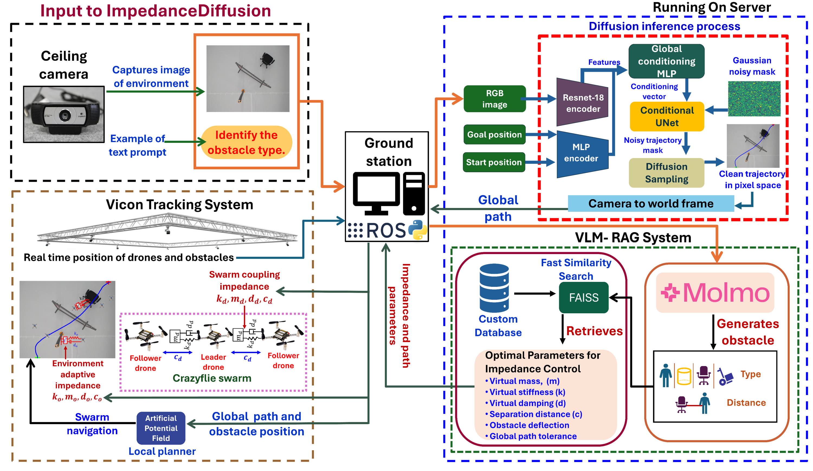
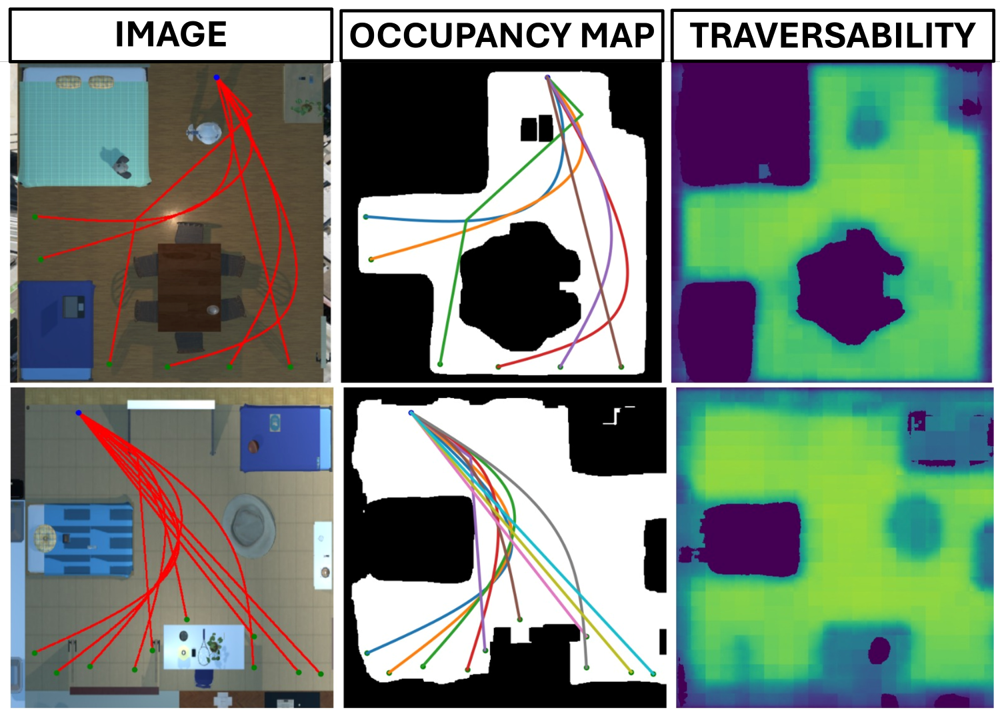
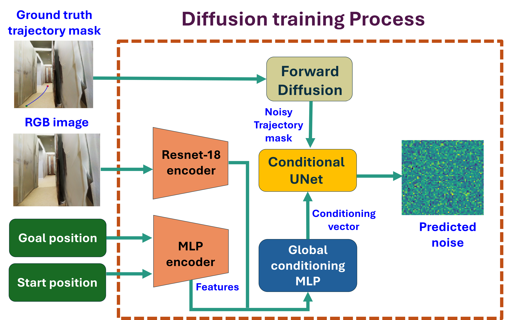
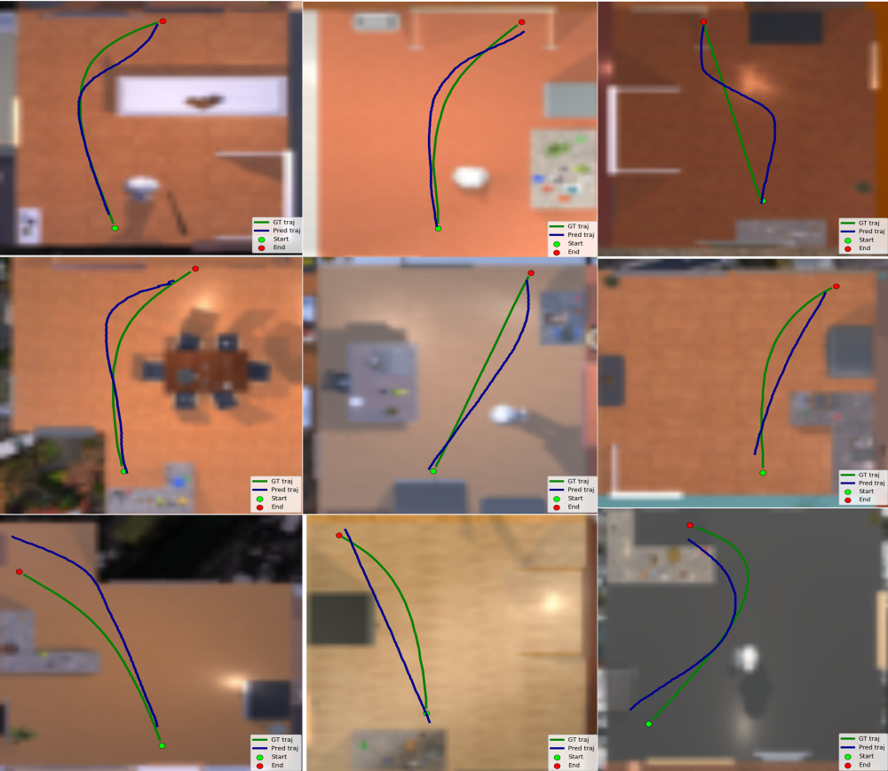
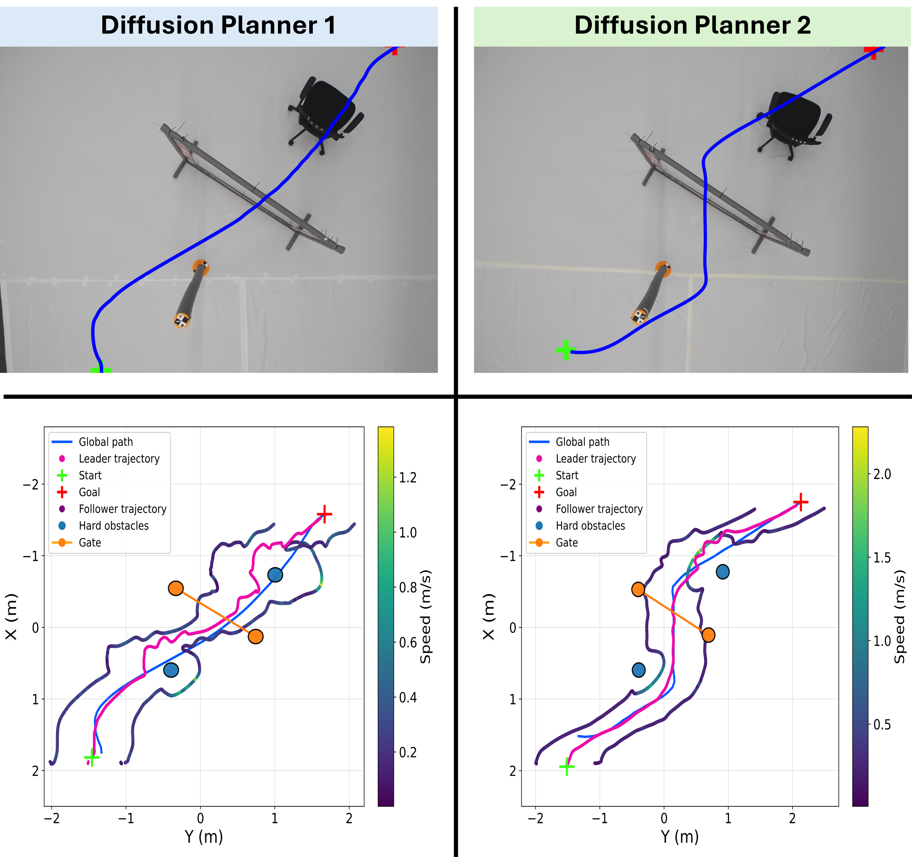
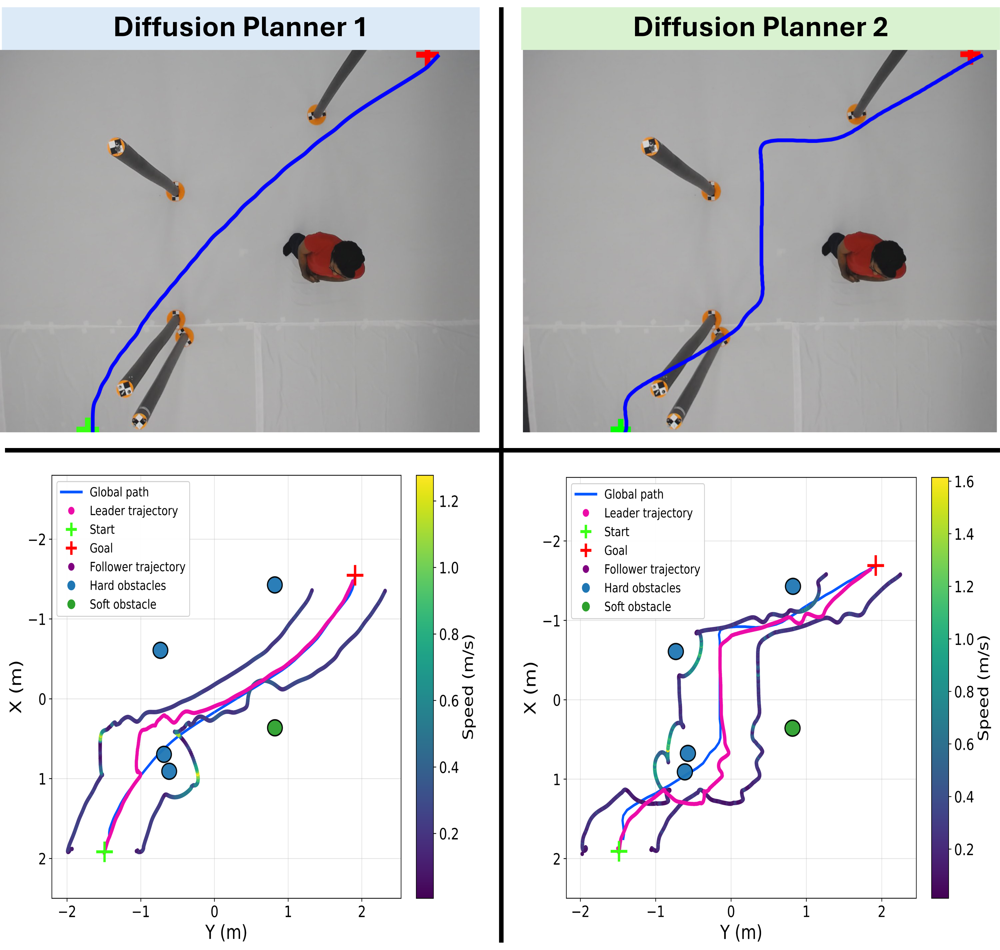
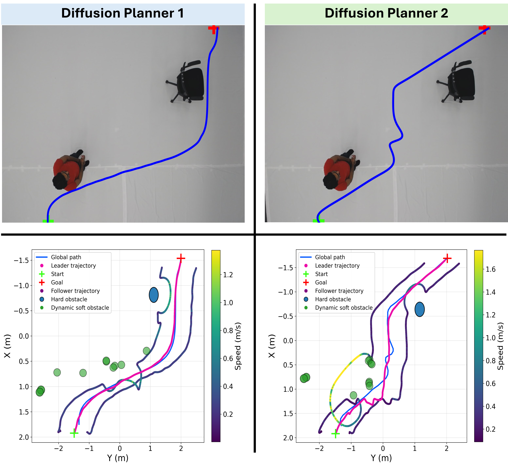
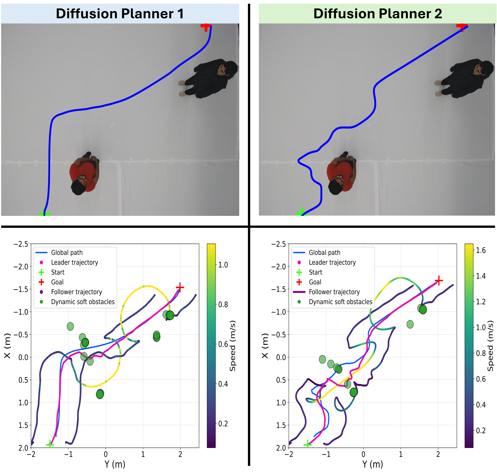

# 🚁 ImpedanceDiffusion

**ImpedanceDiffusion** is an improvement of our baseline work, [ImpedanceGPT](https://github.com/Faryal-Batool/ImpedanceGPT). While **ImpedanceGPT** focused on fixed impedance parameters, the present work advances this direction by introducing **variable impedance control** together with **image-conditioned diffusion-based trajectory generation**, preserving semantic-aware compliant swarm control for mixed hard and soft obstacle environments.

## 📄 Abstract

Safe swarm navigation in cluttered indoor environment requires long-horizon planning, reactive obstacle avoidance, and adaptive compliance. We propose *ImpedanceDiffusion*, a hierarchical framework that leverages image-conditioned diffusion-based global path planning with Artificial Potential Field (APF) tracking and semantic-aware variable impedance control for aerial drone swarms.

The diffusion model generates geometric global trajectories directly from RGB images without requiring explicit map construction. These trajectories are tracked by an APF-based reactive layer, while a VLM--RAG module performs semantic obstacle classification with 90% retrieval accuracy to adapt impedance parameters for mixed obstacle environments during execution.
Two diffusion planners are evaluated: (i) a top-view long-horizon planner using single-pass inference and (ii) a first-person-view (FPV) short-horizon planner deployed via a two-stage inference pipeline on top view. Both planners achieve a 100% trajectory generation rate across twenty static and dynamic experimental configurations and are validated via zero-shot sim-to-real deployment on Crazyflie 2.1 drones through the hierarchical APF--impedance control stack.
The top-view planner produces smoother trajectories that yield conservative tracking speeds of 1.0--1.2 m/s near hard obstacles and 0.6--1.0 m/s near soft obstacles. In contrast, the FPV planner generates trajectories with greater local clearance and typically higher speeds, reaching 1.4--2.0 m/s near hard obstacles and up to 1.6 m/s near soft obstacles. Across 20 experimental configurations (100 total runs), the framework achieved a 92% success rate while maintaining stable impedance-based formation control with bounded oscillations and no in-flight collisions, demonstrating reliable and adaptive swarm navigation in cluttered indoor environments.

## 🌟 Main Contributions

- Introduces a diffusion-based global path planner for UAV swarm navigation directly from RGB observations, without explicit map construction.
- Integrates diffusion planning with APF tracking and semantic-aware variable impedance control in a single hierarchical navigation stack.
- Extends the impedance adaptation idea from `ImpedanceGPT` to mixed obstacle environments using VLM-RAG retrieval of obstacle-specific impedance parameters.
- Evaluates two diffusion planners: a top-view long-horizon planner and an FPV-based two-stage planner.
- Demonstrates zero-shot sim-to-real deployment on Crazyflie 2.1 drones with 100% trajectory generation across all evaluated scenarios and 92% overall experimental success rate.

## 🧠 System Architecture

The overall system combines semantic scene understanding, diffusion-based planning, reactive tracking, and compliant swarm control. A top-view scene image is processed in parallel by:

- a **VLM-RAG module** to classify obstacle types and retrieve safe impedance parameters
- a **diffusion planner** to generate the global path
- an **APF-based reactive layer** to track the generated trajectory online
- an **impedance control layer** to maintain formation and adapt drone-obstacle interactions for hard and soft obstacles



## 🛠️ Installation


Clone the repository:

```bash
git clone https://github.com/Faryal-Batool/ImpedanceDiffusion.git
cd ImpedanceDiffusion
```

Create a Python environment:

```bash
python -m venv .venv
source .venv/bin/activate
```

Install the core Python dependencies used by the diffusion training and inference scripts:

```bash
pip install torch torchvision numpy matplotlib pillow tqdm tensorboard scipy
```

Notes:

- The diffusion code in this repo is centered around [`main.py`](main.py), [`src/train.py`](src/train.py), and the scripts in [`src`](src).
- Real-world swarm execution also depends on a ROS/Crazyflie runtime and an external package referenced by [`run_swarm_experiment.py`](run_swarm_experiment.py) as `variable_impedance_control`.
- Pretrained checkpoints are already included under [`results`](results).

## 🚀 Usage

### Train the diffusion planner

Training starts from [`main.py`](main.py):

```bash
python main.py \
  --data_root data_sample \
  --generator_type 0 \
  --diffusion_model 1 \
  --training_type 1 \
  --diffusion_time_steps 100 \
  --device 0
```

Useful training files:

- [`main.py`](main.py): entrypoint for training
- [`src/train.py`](src/train.py): training and evaluation loop
- [`src/utils/arguments.py`](src/utils/arguments.py): command-line configuration

### Run top-view planner inference

Use:

```bash
python TOP_Planner_inference_for_real_world.py
```

This script loads a top-view diffusion checkpoint and exports:

- path overlays
- pixel-space trajectory CSVs
- world-coordinate trajectory CSVs

Before running it, update the image paths and checkpoint paths inside [`TOP_Planner_inference_for_real_world.py`](TOP_Planner_inference_for_real_world.py) to match your environment.

### Run FPV planner inference

Use:

```bash
python FPV_Planner_inference_for_real_world.py
```

This script runs the two-stage FPV-style planning pipeline described in the paper. As with the top-view script, update the hardcoded image and checkpoint paths before execution.

### Run the impedance-based swarm experiment

Use:

```bash
python3 run_swarm_experiment.py --csv-path /path/to/global_path.csv
```

The CSV must contain:

- `x_m`
- `y_m`
- `z_m`

Example:

```bash
python3 run_swarm_experiment.py \
  --csv-path /path/to/global_path.csv \
  --output-dir /path/to/output_results \
  --experiment Exp_9_dynamic \
  --z-takeoff 1.0 \
  --center 1.8,-1.5,1.0 \
  --obstacles human_1,trolley_1 \
  --pose-topic /poses
```

The runner writes:

- `logs/drone_poses_<experiment>.txt`
- `logs/obstacles_<experiment>.txt`
- `logs/drone_poses_<experiment>.csv`
- `logs/obstacles_<experiment>.csv`
- `graphs/trajectories_exp.png`

## 🧪 Collecting Impedance Data Through Real-World Experiments

To construct the impedance database, the paper reports **200 real-world swarm experiments** in heterogeneous indoor environments containing both rigid and soft obstacles. These experiments were used to validate safe parameter sets for drone-drone and drone-obstacle interactions.

### Table 1. Experimentally validated safe virtual impedance link and path parameters

| **Drone-Drone Parameters** | **Cyl.** | **Chair** | **Trolley** | **Gate** | **Human** |
| --- | ---: | ---: | ---: | ---: | ---: |
| Virtual Mass (kg) | 1 | 1 | 0.8 | 1 | 5 |
| Virtual Stiffness (N/m) | 7 | 7 | 7 | 7 | 1 |
| Virtual Damping (Ns/m) | 3 | 3 | 3 | 3 | 2 |

| **Drone-Obstacle Parameters** | **Cyl.** | **Chair** | **Trolley** | **Gate** | **Human** |
| --- | ---: | ---: | ---: | ---: | ---: |
| Virtual Mass (kg) | 1 | 0.8 | 0.8 | 1.2 | 1 |
| Virtual Stiffness (N/m) | 9 | 10 | 5 | 8 | 16 |
| Virtual Damping (Ns/m) | 5 | 5.5 | 3 | 5 | 4 |

| **Path Parameters** | **Cyl.** | **Chair** | **Trolley** | **Gate** | **Human** |
| --- | ---: | ---: | ---: | ---: | ---: |
| Separation Distance (m) | 0.5 | 0.5 | 0.55 | 0.4 | 0.55 |
| Obstacle Deflection (m) | 0.65 | 0.8 | 1.2 | 0.45 | 1 |
| Global Path Tolerance (m) | 0.3 | 0.4 | 0.5 | 0.5 | 0.5 |

## 🗺️ Diffusion Training

The paper studies two planners:

- **Diffusion Planner 1**: top-view, long-horizon global planning
- **Diffusion Planner 2**: FPV-based, short-horizon two-stage planning

Planner 2 is described in the paper as an improved extension of:

- https://github.com/Faryal-Batool/HumanDiffusion

### Dataset generation



- Planner 1 is trained on top-view A*-generated trajectories from ProcTHOR.
- Planner 2 is trained on simulated indoor FPV-style trajectories.
- The paper reports the best training setup with **100 diffusion steps** and **30 epochs**.

### Training process



## ⚙️ Impedance Control

The impedance module preserves formation stability and obstacle-aware compliance during execution. In this repository, the related implementation is organized under [`variable_impedance_control`](variable_impedance_control), while the runtime experiment wrapper is exposed through [`run_swarm_experiment.py`](run_swarm_experiment.py).

## 📊 Results

Across 20 experimental configurations and 100 total runs, the paper reports:

- **92% overall success rate**
- **100% trajectory generation rate** for both planners
- **90% VLM-RAG retrieval accuracy**

### 🖥️ Diffusion results in simulation



The simulation results show stable trajectory generation in cluttered indoor scenes. The top-view planner produces smoother long-horizon paths, while the FPV-based planner tends to keep stronger local clearance around visible obstacles.

### 🧱 Static experiment 01



This static scenario highlights rigid compliance near hard obstacles and more direct trajectories from the top-view planner.

### 🧍 Static experiment 02



This mixed scene includes hard obstacles and a human, showing the expected impedance switch toward softer compliant behavior near the human.

### 🚶 Dynamic experiment 01



This setup includes one moving human and one hard obstacle. The FPV planner tends to keep larger clearance, while the controller maintains soft compliance near the human and rigid compliance near the chair.

### 🚶‍➡️ Dynamic experiment 02



This scenario contains two moving humans and demonstrates stable soft-compliant avoidance with bounded oscillations.

## 📈 Planner Comparison

| Exp. | Scenario | Planner | Path (m) | Collision Ratio | Goal Error (m) | Total Turning (rad) |
| --- | --- | --- | ---: | ---: | ---: | ---: |
| E1 | Cyl.-Gate | P1 | 2.013 | 0.186 | 0.026 | 10.541 |
| E1 | Cyl.-Gate | P2 | 2.191 | 0.067 | 0.028 | 7.279 |
| E2 | 2 Cyl.-Gate | P1 | 2.148 | 0.352 | 0.044 | 9.254 |
| E2 | 2 Cyl.-Gate | P2 | 2.235 | 0.146 | 0.047 | 9.022 |
| E3 | Cyl.-Gate-Chair | P1 | 2.093 | 0.338 | 0.016 | 11.333 |
| E3 | Cyl.-Gate-Chair | P2 | 2.270 | 0.369 | 0.147 | 8.553 |
| E4 | Chair-Trolley | P1 | 2.198 | 0.486 | 0.050 | 9.811 |
| E4 | Chair-Trolley | P2 | 2.191 | 0.295 | 0.050 | 10.216 |
| E5 | 5 Cyl. | P1 | 2.105 | 0.693 | 0.044 | 9.190 |
| E5 | 5 Cyl. | P2 | 2.351 | 0.447 | 0.045 | 11.812 |
| E6 | 4 Cyl.-Human | P1 | 2.078 | 0.380 | 0.044 | 9.893 |
| E6 | 4 Cyl.-Human | P2 | 2.366 | 0.447 | 0.045 | 9.304 |
| E7 | Human-Chair | P1 | 2.338 | 0.318 | 0.034 | 8.099 |
| E7 | Human-Chair | P2 | 2.354 | 0.119 | 0.034 | 15.313 |
| E8 | 2 Human | P1 | 2.339 | 0.036 | 0.045 | 7.117 |
| E8 | 2 Human | P2 | 2.509 | 0.085 | 0.047 | 16.760 |

Short summary:

- **Planner 1** is faster and smoother.
- **Planner 2** offers stronger local obstacle clearance.
- Both planners maintain 100% trajectory generation across the evaluated scenarios.

## 🎥 Experiment Video

[](https://www.youtube.com/watch?v=J-Ec2arIJVw)

## 📚 Citation

arXiv: https://arxiv.org/abs/2603.09031

```bibtex
@misc{batool2026impedancediffusiondiffusionbasedglobalpath,
      title={ImpedanceDiffusion: Diffusion-Based Global Path Planning for UAV Swarm Navigation with Generative Impedance Control},
      author={Faryal Batool and Yasheerah Yaqoot and Muhammad Ahsan Mustafa and Roohan Ahmed Khan and Aleksey Fedoseev and Dzmitry Tsetserukou},
      year={2026},
      eprint={2603.09031},
      archivePrefix={arXiv},
      primaryClass={cs.RO},
      url={https://arxiv.org/abs/2603.09031},
}
```
